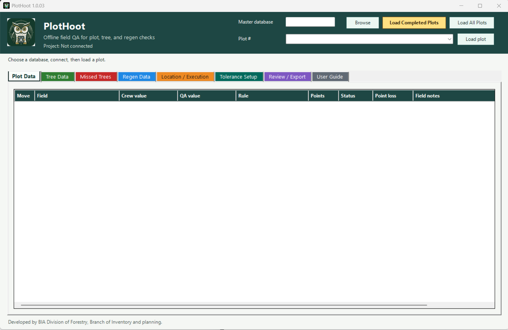

# PlotHoot

PlotHoot is a 100% offline Windows desktop app for QA field checks against BIA CFI Access project databases. It reads the selected master or project database, loads checked AppColumns fields for a selected plot, and lets a QA observer enter independent field values beside the crew values.

## Application screenshot

## Application screenshot

<p align="center">
  <a href="docs/images/plot-hoot-main.png">
    
  </a>
</p>

## Platform support

PlotHoot runs on Windows desktops and Windows tablets such as Microsoft Surface. The launchers do not run on Android or iOS. Android and iOS devices can open exported CSV files and offline HTML reports, but they cannot run the PlotHoot app or connect directly to Access `.mdb/.accdb` databases.

## What it does

- Opens `.mdb` or `.accdb` databases read-only.
- Loads active `AppColumns` fields for plot, tree, and regen data.
- Orders plot, tree, and regen fields from the database measurement queries when available: `GetPlotMeasurementsForPeriod`, `GetTreeMeasurementsForPeriodByKey`, and `GetRegenMeasurements`.
- Lets the QA user customize field order directly from Plot Data, Tree Data, and Regen Data by dragging the far-left `Move` handle.
- Skips system and calculated fields such as IDs, keys, `GMP`, and `Calc...` fields.
- Skips `PlotNumber` and `RealDBH` in the Tree Data section.
- Provides tabs for Plot Data, Tree Data, Regen Data, Tolerance Setup, Review / Export, and User Guide.
- Automatically creates QA rows for every field-collected tree on the loaded plot.
- Lets the QA user move tree-by-tree with previous/next navigation while still saving all tree rows.
- Automatically creates QA rows for every regen record on the loaded plot.
- Includes a Location / Execution tab for Table D Good/Fair/Poor checks with editable Tolerance Setup rules and the GPS critical-fail item.
- Supports tap-to-sort column headers on the QA, settings, and review grids.
- Compares QA values to crew values using editable tolerances.
- Scores checks using `AppColumns.QApoints` for database fields, editable Points overrides in the app, editable `GoodFairPoor` values for Location / Execution, and a max point-loss threshold.
- Supports critical-fail items, including the built-in `Tree found by QA` check for missing trees.
- Tracks multiple saved plot QA checks in one session.
- Exports and imports the complete QA session as CSV.
- Exports failed plots as CSV and formatted offline HTML, including check cruiser, check cruise date, QA remarks, and UTM coordinates.
- Never writes QA data back to the selected database.

## Run

For normal field use, start with the app-style shortcut in the parent folder:

```text
..\PlotHoot.lnk
```

When moving PlotHoot to a tablet, copy the entire PlotHoot version folder. Do not copy only `PlotHoot.lnk`, `PlotHoot-Clean.cmd`, or `Create PlotHoot Desktop Shortcut.cmd`; those launchers need the `PlotHoot App Files` folder beside them.

An owl loading screen appears while PlotHoot prepares the app window.

This shortcut starts PlotHoot hidden through Windows PowerShell and uses the icon inside this folder:

```text
Assets\PlotHoot.ico
```

If the folder was copied to a tablet, run this once while signed into the tablet account that will use PlotHoot:

```text
..\Create PlotHoot Desktop Shortcut.cmd
```

It repairs the parent-folder `PlotHoot.lnk` and creates a `PlotHoot.lnk` shortcut on that Windows user's desktop with the included PlotHoot icon. Run it once for the guest account and once for the admin account if both accounts need their own desktop shortcut.

For security review, use the clean launcher in the parent folder:

```text
..\PlotHoot-Clean.cmd
```

This launcher does not use VBS, encoded payloads, or dynamic script blocks. It uses a per-launch execution-policy bypass so locked-down tablet or guest accounts can start PlotHoot without changing Windows policy or needing admin rights. It opens a command window and may sit for a few seconds while PlotHoot starts; that is expected for the troubleshooting launcher. It does need the `PlotHoot App Files` folder beside it.

Backup app-files launcher:

```text
PlotHoot.vbs
```

Backup launcher:

```text
PlotHoot-Backup.vbs
```

Troubleshooting:

```text
Run-PlotHoot-32bit.bat
```

The old one-file tablet launcher has been removed from the app package. Android and iOS can still open exported reports, but they cannot run the Windows app.

## User guide

The main offline guide is now in the parent folder:

```text
..\PlotHoot User Guide.html
```

## Typical workflow

1. Click `Browse` and choose the master or project database.
2. Click `Load Completed Plots` to load only plots with `InventoryAssignmentPlots.StatusID = 4` into the dropdown. Use `Load All Plots` only when you need a plot that has not been marked completed.
3. Choose a plot number.
4. Click `Load plot`.
5. Enter QA values in the Plot Data tab.
6. On the Tree Data tab, move through every loaded tree with `Previous tree` and `Next tree`, entering QA values for each tree.
7. Leave `Show selected tree only` checked for a clean one-tree-at-a-time workflow, or uncheck it to see every tree row at once.
8. On the Regen Data tab, review all loaded regen records together by default. The `Entry` column shows which regen record each row belongs to. Use `Previous regen` and `Next regen` only when you want to jump to a specific regen record.
9. Adjust tolerances on the Tolerance Setup tab if the project needs different rules. To move fields, drag the far-left `Move` handle in Plot Data, Tree Data, or Regen Data.
10. Add the required check cruiser name, check cruise date, and plot-level QA remarks on Review / Export.
11. Click `Save QA`.
12. Export QA Results, all QA rows, failed plot CSV, or QA Report HTML.

## Tolerance modes

- `Exact`: the QA value must match the crew value exactly. Use this for codes or text where no tolerance is allowed. The Value cell is gray and uneditable because no tolerance amount is needed.
- `Range`: numeric plus/minus tolerance. Use this for DBH `0.20`, UTM easting/northing `30` feet, elevation `100`, or any field where the allowed difference is a fixed number.
- `Percent`: numeric percent tolerance. Height-style fields use relative percent around the crew value. Fields that are already percentages or ratios, such as Slope Percent and Crown Ratio, use plus/minus percentage points.
- `Class`: numeric class tolerance. Use this for class-style fields where being within `1` class is acceptable.
- `PassFail`: compares pass/fail style values and treats common equivalents like yes/pass/true or no/fail/false as the same.
- `Filled`: checkbox check that the crew/database value was supplied. Filled checkboxes start unchecked. Crew, measurement day/date, plot number, and tree number default to this because the QA check is not an exact-value comparison.
- `GoodFairPoor`: Location / Execution ratings. Use point-loss values like `Good=0; Fair=1; Poor=2`, or set `Fair=0` when Fair should pass.

Defaults are assigned by field name. Tree DBH-like fields default to `Range 0.20`, UTM easting/northing defaults to `Range 30`, elevation defaults to `Range 100`, height-like fields default to `Percent 5`, crown ratio defaults to `Percent 10`, class-like fields default to `Class 1`, and regen IDBH defaults to `Exact`.

Tree `IDBH` values stored as whole-number tenths are compared as inches. For example, crew `60` and QA `62` are treated as 6.0 and 6.2 inches, so they pass with `Range 0.20`.

Already-percent fields are compared by percentage points. For example, Slope Percent crew `40` and QA `45` pass with `Percent 5`.

For example, to allow elevation to pass within plus/minus 100 feet, set the Elevation row to `Range` and set Value to `100`.

Hover over a control, or press-and-hold with touch, to see short tooltips for settings, scoring, and export fields.

On Windows tablets, numeric QA fields, species/code fields, tolerance values, points, and max-loss boxes request the number keyboard. Text, notes, remarks, and pass/fail-style fields request the normal text keyboard.

Tap a typed QA value cell once to start editing. After entering a QA value, press `Enter`, `Next`, or `Tab` on the keyboard to save that value and move straight down to the next QA value field, ready for typing. Checkbox checks are marked by tapping the checkbox. Tree and regen tabs advance to the next selected tree or regen record when the last visible field is complete.

Crew, measurement day/date, plot number, and tree number default to a simple `Filled` checkbox check that starts unchecked until the QA user marks it. Plot, tree, and regen remarks are not tolerance items. Double-click a `Crew value` cell to open long database text in a larger read-only box.

The Tolerance Setup table comes from checked active `AppColumns` fields when `AppColumns` is available. PlotHoot skips office/system fields such as IDs, `GMP`, fields beginning with `Calc`, per-acre expansion, FLC commercial, Management Unit, `PlotNumber` in Tree/Regen Data, `RealDBH` in Tree Data, and plot/tree/regen remarks. If `AppColumns` is not available, PlotHoot falls back to readable database fields.

Use the `Show` filter on Tolerance Setup to view only Plot, Tree, Regen, or Location / Execution rows. Uncheck `Use` to remove a field from loaded QA rows for this setup, then click `Save setup`.

To customize field order, drag the far-left `Move` handle directly in Plot Data, Tree Data, or Regen Data. You can also drag the `Field` cell. Moving a tree or regen field applies that field order to every loaded tree or regen entry. PlotHoot saves the new order automatically for future loaded plots. Saved custom order is used first. If no custom order is saved, PlotHoot uses the database measurement query order when Access exposes it, then AppColumns order as a fallback. `Reset defaults` clears saved custom order and returns to the database query/AppColumns order. Full QA CSV exports include the saved field order so another tablet can import the same setup and restore the moved layout.

## Scoring

For regen stem counts, use the `Use Stem Count Percentage For Scoring` checkbox at the top of Tolerance Setup. When it is unchecked, regen stem count rows use `StemCount` and the sliding stem-count tolerance table is active. When it is checked, regen stem count rows use `StemPercent`, the stem-count table is disabled, and the percentage-basis method is used: the default Value `Allowance=10; Step=5` allows the first 10% error, then charges the row's `Points` for each started 5% above that allowance. Example: crew count 5 and QA count 7 is about 29% error; 29 - 10 = 19; 19 / 5 rounds up to 4 steps; with Points = 2, point loss is 8.

The Regen stem count tolerances table is used only when `Use Stem Count Percentage For Scoring` is unchecked. The QA cruiser count is presumed correct and chooses the count range. The `Tolerance` value is the allowed plus/minus difference between the crew count and the QA cruiser count. Tolerance cells are blank by default; blank means exact match is required until you enter an allowed difference. When percentage scoring is checked, the table is completely disabled/gray because it is not used. The checkbox choice and table settings save locally and export/import with the setup rows.

Most field `Points` start from `AppColumns.QApoints`. You can edit `Points` in Tolerance Setup or directly in a loaded Plot, Tree, or Regen QA table for the current QA work. Location / Execution points come from the `GoodFairPoor` Value, such as `Good=0; Fair=1; Poor=2`. Failed non-critical rows add point loss. Failed critical rows force the plot to fail.

`Fail cutoff` is optional. It is the total point-loss cutoff for the whole plot. When it is blank, PlotHoot does not use a total point-loss cutoff; critical failures and any section maxes you enter can still fail the plot. If you enter `25`, total error greater than `25` fails the plot. Older notes may call this `loss cutoff`. `PassFail` fields default to critical fail, and the app adds a `Tree found by QA` PassFail row to each loaded tree so a missing tree can be marked as a plot-level failure.

`Plot max loss`, `Tree max/tree`, `Regen max loss`, and `Table D max loss` are optional section caps. Leave a section max blank to let PlotHoot use the loaded row point sum for that section.

`Regen max loss` is optional whether you use the stem-count table or the stem-count percentage method. The percentage checkbox only changes how regen stem count row errors are calculated; it does not make `Regen max loss` required.

When `Tree max/tree` is filled in, it is multiplied by the number of loaded trees on the plot. Example: `3` max points per tree and `10` trees gives a Tree Classification max of `30`; more than `30` tree point loss fails the plot.

In the Summary of Check Cruise, `Total max point loss` is the section max sum. Blank section maxes show the loaded row point sum, and a blank failure threshold shows `Not set`.

The Location / Execution tab captures Table D from the check form, excluding `Plot Tally Sheets Neatness/Legibility`. Those rows appear in Tolerance Setup with the `GoodFairPoor` tolerance. `Good` is always 0 point loss. `Fair` and `Poor` use the point loss written in the Value cell, such as `Good=0; Fair=1; Poor=2`. Set `Fair=0` when Fair should pass. A `Poor` rating becomes an automatic plot failure when `Critical fail` is checked. GPS defaults to `Good=0; Fair=0; Poor=0` with `Critical fail` checked, so only GPS marked `Poor` forces the plot to fail.

If a Location / Execution Value cell is edited, PlotHoot reformats it back to the `Good=0; Fair=1; Poor=2` style so the Good/Fair/Poor labels stay visible.

## Output files

The full QA CSV is a flat record of every saved field check plus setup/tolerance/scoring/Use-field/field-order rows. Rows marked `QA` are field checks. Rows marked `Setting` preserve the setup so the same file can restore the QA setup later, including removed-field choices. Moved field order is saved in setup rows and also carried on QA rows as a fallback. CSV rows include `ProjectName`, check cruiser, and check cruise date.

When importing the full QA CSV, PlotHoot restores the setup/tolerance/scoring settings from the file and then imports the saved plot QA checks. Older PlotHoot CSV files without a `RecordType` column still import as QA rows.

Export QA Results creates an Excel `.xlsx` file with real tabs: `Summary`, `Passed Plots`, `Failed Plots`, `Audited Plot Data`, `Audited Tree Data`, `Audited Regen Data`, `Audited Location Data`, and `Setup Settings`. Use this when you want the QA information split into workbook tabs.

The failed plot CSV is a compact navigation and review list with `ProjectName`, check cruiser, check cruise date, BIA inventory QA progress, QA remarks, failed checks, and UTM values. It does not carry the full setup settings; use the full QA CSV for that.

The QA Report HTML is a formatted offline report that opens in a browser on the tablet or desktop. It starts with a summary page, shows total trees audited and errors, lists passed plots and failed plots with UTMs and failure reasons, and includes filterable tabs for audited plot, tree, regen, and location data.

## Tree and regen workflow

When a plot loads, PlotHoot loads every tree and regen record for that plot and creates QA cells beside the crew/database values. The Tree Data tab shows one selected tree at a time by default so large plots stay readable. The Regen Data tab shows all regen records at once by default, with the `Entry` column identifying the regen record for each row. The dropdowns and previous/next buttons can still jump through each loaded list, and any filtered hidden rows remain part of the saved QA session and exports.

The overall status is `Incomplete` until the loaded plot check is complete. The status line shows total error, the optional fail cutoff, failed check rows, and unchecked rows. Failed check rows are individual field/check rows with `Fail` status, not failed plots. Critical failures force `Fail`, and completed plots fail if total error is greater than a filled-in failure threshold or a section goes over its configured max.

`Save QA` stores the current plot check even when it is incomplete. The check cruiser name, check cruise date, and QA remarks are saved per plot and included in exports. To finish a plot, fill every required QA row on Plot Data, Tree Data, Regen Data, and Location / Execution. Once there are no unchecked rows, the status changes to `Pass` or `Fail`; PlotHoot does not use a separate `Complete` status.

The Review / Export tab includes a BIA inventory QA progress tracker. It counts saved checked plots against all plots in the connected inventory, uses the 10 percent target, and rounds the required number of plots up to the next whole plot.

## Safety

- The database is read-only to PlotHoot.
- CSV and HTML exports are the only saved QA outputs.
- Settings are saved locally in `Data\PlotHootSettings.json` beside the app when possible. If Windows blocks writing there, PlotHoot uses the current user's local app data folder.
- No internet connection is needed.
- No admin rights are needed.

## Author

Created by Christopher LaCroix.

Developed by BIA Division of Forestry, Branch of Inventory and planning.
